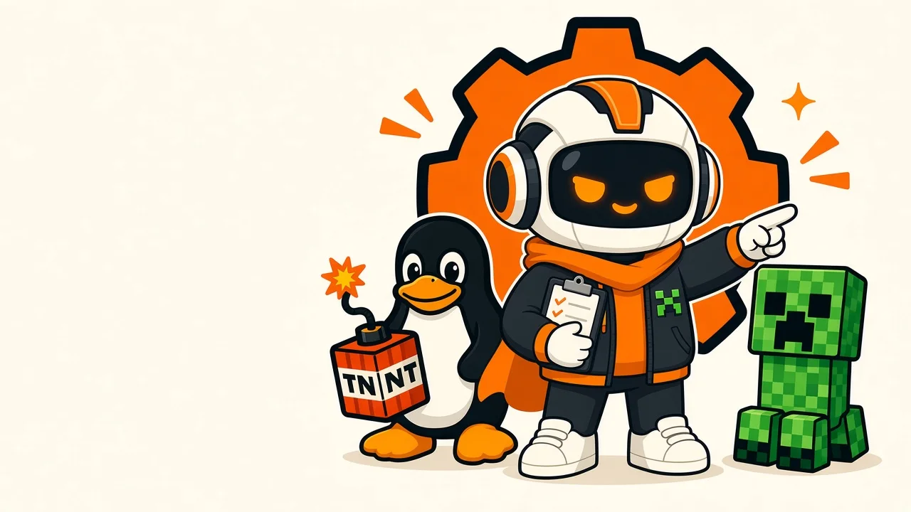

<p align="center">
  
</p>

<h1 align="center">Rejoindre Kernel Forge</h1>

<p align="center">
  <strong>Code. Forge. Impact.</strong><br>
  Le collectif étudiant open source de l’Université de Yaoundé I.
</p>

<p align="center">
  <a href="https://chat.whatsapp.com/IFkGMr4Ev2KCFAKw9EmEde">WhatsApp</a> ·
  <a href="https://discord.gg/qqhVxZzQg">Discord</a> ·
  <a href="https://t.me/kernelforge">Telegram</a> ·
  <a href="https://kernelforge.codes">kernelforge.codes</a>
</p>

---

Ce dépôt est la porte d’entrée du collectif. Il explique **qui nous sommes**, **comment rejoindre l’équipe**, **comment nous travaillons**, et **où nous trouver**. Il n’y a pas de code ici : le code de nos projets est partagé sur demande, une fois que l’on s’est parlé.

```bash
git clone https://github.com/KERNEL-FORGE-G/Joinus.git
cd Joinus && cat README.md
```

## Sommaire

1. [Qui sommes-nous](#qui-sommes-nous)
2. [Rejoindre l’équipe en cinq étapes](#rejoindre-léquipe-en-cinq-étapes)
3. [Notre fonctionnement](#notre-fonctionnement)
4. [Accès au code des projets](#accès-au-code-des-projets)
5. [Nos réseaux](#nos-réseaux)
6. [Contact](#contact)
7. [Règles de vie](#règles-de-vie)
8. [Questions fréquentes](#questions-fréquentes)

## Qui sommes-nous

Kernel Forge est un collectif d’étudiants de l’Université de Yaoundé I (Cameroun). Nous apprenons en construisant : des logiciels libres utiles, documentés et pensés pour notre contexte, puis nous les partageons.

Notre chantier principal s’appelle **UniFlow**, une plateforme universitaire qui fonctionne même sans connexion : cours, présences par QR code, devoirs, notes et bulletins, avec des applications web, mobile, desktop et un backend. À côté, nous menons des projets étudiants, des ateliers (la **Kernel Forge Academy**) et des prestations pour des associations, entreprises et institutions.

Quatre verbes résument la méthode : **construire, apprendre, partager, contribuer.**

<p align="center">
  
</p>

## Rejoindre l’équipe en cinq étapes

Il n’y a pas de test d’entrée. Il y a des tâches de toutes tailles et des personnes pour relire.

### 1. Rejoindre le groupe WhatsApp et se présenter

Tout commence ici : **https://chat.whatsapp.com/IFkGMr4Ev2KCFAKw9EmEde**

Présentez-vous en quelques lignes. Un modèle, à adapter :

```text
Bonjour, je suis <Prénom>, en <niveau et filière>.
Je m’intéresse à : <frontend / mobile / backend / design / rédaction / vidéo>.
Je connais un peu : <langages, outils>.
Je voudrais rejoindre Kernel Forge pour : <un projet précis, ou « apprendre en contribuant »>.
Mon compte GitHub : <pseudo>.
```

### 2. Choisir un pôle

Dites-nous ce qui vous attire. Vous pourrez changer plus tard.

| Pôle | Ce qu’on y fait | Ce qui aide (sans être obligatoire) |
| --- | --- | --- |
| Lead & Architecture | Cadrage, architecture, coordination, revues | Git, une vue d’ensemble d’un produit |
| Frontend | Interfaces web et desktop | HTML/CSS, JavaScript ou TypeScript, React |
| Mobile | Applications Android et iOS, hors ligne | Dart/Flutter, Kotlin |
| Backend & Data | APIs, bases de données, microservices, infra | Node/NestJS, PostgreSQL, Docker, Linux |
| Design & contenu | Maquettes, documentation, tutoriels, vidéos | Figma, rédaction claire, montage |

### 3. Recevoir l’accès à un dépôt et une première tâche

Un membre vous ouvre le dépôt concerné et vous indique une première tâche : souvent une issue marquée *bon premier pas*, une documentation à améliorer ou un bug simple. C’est volontairement petit.

### 4. Faire une première contribution

1. Créez une branche : `type/sujet-court` (ex. `fix/bouton-connexion`, `docs/installation-linux`).
2. Faites des commits clairs, en français ou en anglais, au présent : `Corrige le retour à la ligne du bouton de connexion`.
3. Ouvrez une pull request avec ce que vous avez changé, pourquoi, et comment le tester.
4. Une pull request courte est relue plus vite qu’une longue. Une correction de typo compte.

### 5. Apprendre de la revue

Chaque pull request est relue par au moins un membre. On commente le code, jamais la personne. Une fois intégrée, vous êtes membre du collectif : accès à l’organisation, invitation aux points hebdomadaires, et votre CV public sur [kernelforge.codes/team](https://kernelforge.codes/team) si vous le souhaitez.

## Notre fonctionnement

**Le rythme**

- Des sprints de deux semaines par projet, avec un objectif écrit au départ.
- Un point hebdomadaire sur Discord (voix), court : ce qui avance, ce qui bloque, qui a besoin d’aide.
- Une démo en fin de sprint : on montre ce qui marche, même imparfait.

**Les règles de code**

- Tout passe par une pull request relue par au moins une personne. Personne ne pousse directement sur `main`.
- Le code est accompagné de sa documentation : un `README` qui permet d’installer et de lancer le projet en moins de dix minutes.
- On écrit des tests quand c’est possible, et on ne casse pas ce qui marchait.
- Les décisions importantes (architecture, dépendances, conventions) sont écrites dans le dépôt, pas seulement dites à l’oral.

**Les rôles**

- Chaque projet a un ou une référente qui priorise les issues et garantit que les pull requests sont relues.
- Les membres expérimentés accompagnent les nouveaux : c’est une responsabilité, pas une option.
- Les prestations (sites, applications, installations Linux) sont menées par une équipe constituée pour le projet, avec un cadrage écrit et des livraisons régulières.

**La Kernel Forge Academy**

Ateliers Linux et Git, revues de code en direct, pair programming sur UniFlow. Ouverte aux étudiants du campus, annoncée sur Telegram et WhatsApp.

## Accès au code des projets

Nos dépôts ne sont pas listés publiquement. Ce n’est pas du secret, c’est une façon de faire connaissance d’abord : on sait qui travaille sur quoi, et chaque nouvelle personne arrive avec un accompagnement.

**Pour obtenir l’accès à un projet, écrivez-nous sur WhatsApp** en précisant le projet qui vous intéresse et ce que vous aimeriez y faire : https://chat.whatsapp.com/IFkGMr4Ev2KCFAKw9EmEde

Les projets en cours et leurs technologies sont présentés sur [kernelforge.codes/projects](https://kernelforge.codes/projects).

## Nos réseaux

| Réseau | À quoi il sert | Lien |
| --- | --- | --- |
| WhatsApp | Le quotidien, les demandes d’accès, les questions rapides | https://chat.whatsapp.com/IFkGMr4Ev2KCFAKw9EmEde |
| Discord | Discussions techniques, entraide, points hebdomadaires en voix | https://discord.gg/qqhVxZzQg |
| Telegram | Annonces, sorties, dates des ateliers | https://t.me/kernelforge |
| LinkedIn | Le collectif côté professionnel, projets et collaborations | https://www.linkedin.com/in/kernelforge |
| YouTube | Démonstrations, coulisses, tutoriels | https://www.youtube.com/@KERNEL-FORGE.c |
| Site | Projets, services, équipe, communauté | https://kernelforge.codes |

## Contact

- **WhatsApp (recommandé)** : https://chat.whatsapp.com/IFkGMr4Ev2KCFAKw9EmEde
- **E-mail** : ravelnghomsi@kernelforge.codes
- **Formulaire** : https://kernelforge.codes/contact
- **Où nous trouver** : Université de Yaoundé I, Yaoundé, Cameroun. Nous travaillons aussi à distance.

Pour une demande de prestation (site, application, API, poste Linux), décrivez le contexte, les fonctionnalités souhaitées, votre délai et, si possible, une idée de budget. Les tarifs indicatifs sont sur [kernelforge.codes/services](https://kernelforge.codes/services).

## Règles de vie

- On s’adresse aux autres avec respect, en public comme en privé. Pas de moquerie sur le niveau de quelqu’un : tout le monde a commencé.
- On relit le code, pas la personne. On explique un refus, on propose une piste.
- On dit quand on est bloqué ou indisponible. Un message court vaut mieux qu’un silence de deux semaines.
- On cite ses sources et on respecte les licences des projets que l’on utilise.
- Un problème avec quelqu’un ? Écrivez en privé à la personne référente du projet ou à ravelnghomsi@kernelforge.codes.

## Questions fréquentes

**Je débute complètement. Est-ce pour moi ?**
Oui. Dites-le en vous présentant : on vous orientera vers les ateliers de l’Academy et une première tâche adaptée.

**Je ne suis pas à Yaoundé.**
Ce n’est pas un problème : dépôts partagés, visioconférences, revues en ligne. Les ateliers en présentiel sont filmés quand c’est possible.

**Combien de temps faut-il donner ?**
Ce que vous pouvez. Quelques heures par semaine suffisent pour progresser, à condition d’être régulier et de prévenir quand vous n’êtes pas disponible.

**Je suis designer, rédacteur ou vidéaste, pas développeur.**
Les maquettes, la documentation, les tutoriels et les vidéos sont des contributions à part entière. Bienvenue.

**Puis-je proposer un nouveau projet ?**
Oui. Présentez l’idée sur WhatsApp ou Discord : le besoin, à qui ça sert, ce que vous avez déjà. Les meilleurs projets du collectif ont commencé par une conversation.

---

<p align="center">Kernel Forge, Université de Yaoundé I. <strong>Code. Forge. Impact.</strong></p>
